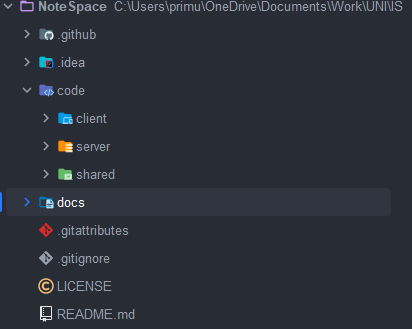

# Notespace - February Report
## Introduction
This is the February report for the Notespace project. This report will cover the progress made in February and the goals for March.
> More information on the project structure is available in the [project structure](../../project-overview-report.md) report.
 
## Project summary
As of 26th of February, the project is in the early stages of development. 
The project structure has been created and the initial setup has been done.
The client project was created using [Vite](https://vitejs.dev) + [React](https://reactjs.org/) PWA template.
The server project was created using [TypeScript](https://www.typescriptlang.org/) template.
A prototype for the [live editor](../features/Editor) has been started and there is now a socket connection between the client and server.

## Progress

The project was started on the 21st of February and the following tasks have been completed:

1. ### Project structure created
The project structure was created and initialized with a git repository; the project was also added to GitHub, 
and the initial setup was done. 

The project structure can be seen below:

2. ### Client project created
The client project was created using [Vite](https://vitejs.dev) as the bundler and [React](https://reactjs.org/) as the frontend library. 
The setup was done using the PWA template provided by Vite.

3. ### Server project created
The server project was created using [Express](https://expressjs.com) and [TypeScript](https://www.typescriptlang.org). 
The setup was done using the TypeScript template.

4. ### Prototype for the live editor started
A initial prototype for the live editor was started. The client and server were then connected using a socket connection.
This socket connection will be used to send and receive changes to the editor, and is supported through the use of the [socket.io](https://socket.io/) library.

5. ### Research on conflict resolution algorithms started

Research on conflict resolution algorithms was started. 
The goal is to find a suitable algorithm that can be used to resolve conflicts in the live editor.
> More details on the conflict resolution algorithms can be found both in the [March report](../March-report.md) 
> and the [ConflictResolution](../../features/Editor.md#ConflictResolution) section.

## Metrics
### Tasks completed:
  - Project structure created
  - Initial setup done
  - Client project created
  - Server project created
  - Prototype for the live editor started
    - Socket connection between client and server
  - Research on conflict resolution algorithms started
